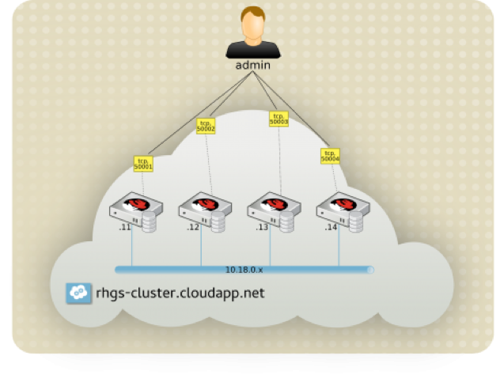
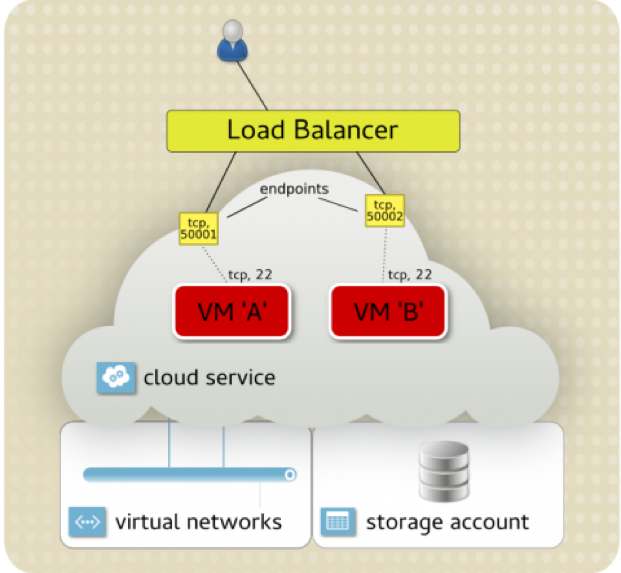

# Red Hat Storage / GlusterFS ON AZURE

> By Khaled Elbedri (@khaled99b), November, 2016

## Overview and Pre-Requisites

An Overview of the scope of the lab, any pre-requisites and topics covered on the lab should be clearly explained here.


### Overview

This lab describes the steps necessary to deploy highly available GlusterFs (Red Hat Storage) environment to Azure using a basic two-node CENTOS 7 configuration. GlusterFS which is the upstream project and considered to be a test bed incubator of Red Hat Storage. 


### Pre-requisites

You don’t need a Red Hat subscription to perform the lab instructions. But you will need a valid Azure account.  Create your [free azure account](https://azure.microsoft.com/en-us/free/) today.
If you are using Windows 10, you can install Bash shell, command line ([http://www.windowscentral.com/how-install-bash-shell-command-line-windows-10](http://www.windowscentral.com/how-install-bash-shell-command-line-windows-10))
To install Azure CLI follow the instructions: [https://azure.microsoft.com/en-us/documentation/articles/xplat-cli-install/](https://azure.microsoft.com/en-us/documentation/articles/xplat-cli-install/) 


### Topics Covered

* GlusterFS Architecture Installation 
* Creating Highly Available (Replicated) GlusterFS Volume on Azure
* Creating a distributed GlusterFS Volume on Azure
* Connect from Linux/Windows clients 
* Extend GlusterFS Volumes without downtime 
* Exploring the graphical console managing GlusterFS cluster


## Inroduction to red hat storage

Red Hat Gluster FS Storage is designed to provide a flexible file services layer for users and applications in a way that can be easily scaled to adjust to storage demanding workloads. Deployment flexibility is a key strength of Red Hat Gluster FS Storage. GlusterFS can be deployed to virtual or physical servers in on-premises environments, private clouds, and public clouds. Microsoft and Red Hat have signed a partnership that includes support to run Red Hat Storage on Microsoft Azure.

Azure offers multiple cloud solutions either as infrastructure-as-a-service (IaaS) or platform-as-a-service (PaaS). For GlusterFS, we will leverage Azure IAAS capabilities to build logical containers (virtual machines) backed by software defined storage (Azure disks).  Then, we will deploy and configure the shared filesystem bricks. Azure provides network services like DNS and DHCP, which makes managing the infrastructure like managing a physical deployment.


## Lab1: Planning the deployment on Azure

### Terminology:

* Gluster Storage server: The virtual machine which hosts the file system in which data will be stored. 
* Gluster Storage client: The virtual machine which mounts the GlusterFS shared volumes.
* Brick: The brick is a disk partition with XFS file system that has been assigned to a Volume. 
* GlusterFS Volume: The logical collection of bricks. 

### Lab configuration:

We will use Azure virtual machines to create a two nodes GlusterFS cluster. A Linux and Windows clients will be used to demonstrate mounting and consuming software defined storage exported by the GlusterFS cluster

Servers:

| Node1         | Node2          |
| ------------- | -------------- |
| CentOS 7.2    | CentOS 7.2     |


Clients:

| Node3         | Windows-client            |
| ------------- | ------------------------- |
| CentOS 7.2    | Windows Server 2008 x64   |




*[Fig1: GlusterFS simplified architecture]*

To add another layer of resiliency to our architecture, we will provision GlusterFS cluster nodes into an Azure availability set.

An Azure availability set provides a level of fault tolerance to the instances it holds, protecting against system failure or planned outages. This is achieved by ensuring instances within the same availability set are deployed across different fault and upgrade domains within an Azure datacenter. By using availability sets in the replication design, incidents within the Azure infrastructure cannot affect all members of a replica set simultaneously.

1. Start a *Bash* session and login to your Azure account

```
# azure login
```

2. Make sure the Azure CLI is using Resource Manager mode

```
# azure config mode arm
    info:    Executing command config mode
    info:    New mode is arm
    info:    config mode command OK
```

3. Create an `ssh` keypair with a blank passphrase 

```shell
# ssh-keygen
    Generating public/private rsa key pair.
    Enter file in which to save the key (/home/azureuser/.ssh/id_rsa):
    Enter passphrase (empty for no passphrase):
    Enter same passphrase again:
    Your identification has been saved in /home/azureuser/.ssh/id_rsa.
    Your public key has been saved in /home/azureuser/.ssh/id_rsa.pub.
    The key fingerprint is:
    ... output omitted ...
```

4. Create a new Azure resource group `glusterfsRG` in your preferred region

```
# azure group create glusterfsRG northeurope
    info:    Executing command group create
    + Getting resource group glusterfsRG
    + Creating resource group glusterfsRG
    info:    Created resource group glusterfsRG
    data:    Id:                  /subscriptions/f3a5dfdb-e853-42d9-b23c-752c896c0290/resourceGroups/ glusterfsRG
    data:    Name:                glusterfsRG
    data:    Location:            northeurope
    data:    Provisioning State:  Succeeded
    data:    Tags: null
    data:
    info:    group create command OK
```

5. Create a new availability set `glusteras`

```
# azure availset create glusterfsRG glusteras northeurope
    info:    Executing command availset create
    + Looking up the availability set "glusteras"
    + Creating availability set "glusteras"
    info:    availset create command OK
```

6. Create Linux CentOS virtual machines *node1* and replace RANDOMSTRING by any random string, to be unique.

```
# azure vm create glusterfsRG node1 northeurope -F gluster-vnet -j gluster-snet -f nic-node1 -P 10.0.0.0/16 -k 10.0.1.0/24 -i node1-pub -w node1glusterRANDOMSTRING -y Linux -Q OpenLogic:CentOS:7.2:latest -u azureuser -M .ssh/id_rsa.pub -r glusteras
```

7. Create similar virtual machine *node2* in the same vnet/subnet as *node1*.  Replace RANDOMSTRING by any random string, to be unique

```
# azure vm create glusterfsRG node2 northeurope -F gluster-vnet -j gluster-snet -f nic-node2 -i node2-pub -w node2glusterRANDOMSTRING -y Linux -Q OpenLogic:CentOS:7.2:latest -u azureuser -M .ssh/id_rsa.pub -r glusteras
```

8. Show the two provisioned nodes

```
# azure vm list glusterfsRG | grep node
# azure vm show glusterfsRG node1
```

9. Note the public IP addresses of your newly created vms

```
# azure vm list-ip-address | grep GLUSTERFSRG
    data:    GLUSTERFSRG        node1            52.149.219.230
    data:    GLUSTERFSRG        node2            52.154.143.136	
```

10. Ssh to the *node1* and *node2* and make sure to install any available updates

```
# ssh -i .ssh/id_rsa azureuser@NODE-PubIP
    [node1]# sudo yum update -y
```

11. Create a new yum repository `/etc/yum.repos.d/glusterfs-epel.repo` and add the following:

```
[glusterfs-epel]
name=GlusterFS is a clustered file-system capable of scaling to several petabytes.
baseurl=http://buildlogs.centos.org/centos/7/storage/x86_64/gluster-3.8/
enabled=1
skip_if_unavailable=1
gpgcheck=0
```

12. Install the latest *EPEL* repository from *fedoraproject.org* to resolve all dependencies: 

```
[node1] # sudo yum -y install http://dl.fedoraproject.org/pub/epel/epel-release-latest-7.noarch.rpm
```

13. Make sure both repositories are enabled by default: 

```
[node1] # sudo yum repolist
    ... output omitted ...
    repo id            repo name                   status
    base/7/x86_64      CentOS-7 - Base              9,007
    epel/x86_64        Extra Packages for Enterprise Linux 7 - x86_64                       10,765
    extras/7/x86_64    CentOS-7 - Extras             393
    glusterfs-epel     GlusterFS is a clustered file-system capable of scaling to several p    162
    openlogic/7/x86_64 CentOS-7 - openlogic packages for x86_64                                 48
    updates/7/x86_64   CentOS-7 - Updates          2,560
    repolist: 22,935
```

14. Install *GlusterFS* Server and *Samba* packages

```
[node1] # sudo yum install glusterfs-server samba -y
```

## Lab2: Creating the Bricks

In the next steps, we will add two new disks to each GlusterFS cluster node. To create a big backend storage pool, we will stripe the disks into a RAID0 array. That configuration, potentially allows higher IOPS. 

For simplicity reasons, we will use disks with 10Gb capacity, only. The array on each node will then be used to create two GlusterFS bricks which will be used to create GlusterFS volumes. 

1.	Attach 2 x 10 GB data disks to node1

```
# for n in {1..2}; do azure vm disk attach-new glusterfsRG node1 10; done
```

2. List the system’s partition table and make sure you have 2 new disks (`/dev/sdc` and `/dev/sdd`)

```
[node1] # sudo fdisk -l
    ... output omitted ...
    Device Boot      Start         End      Blocks   Id  System
    /dev/sda1   *        2048    62914559    31456256   83  Linux
    ... output omitted ...
    /dev/sdb1             128    14678015     7338944   83  Linux
    ... output omitted ...
    Disk /dev/sdc: 10.7 GB, 10737418240 bytes, 20971520 sectors
    ... output omitted ...
    Disk /dev/sdd: 10.7 GB, 10737418240 bytes, 20971520 sectors
```

3. Combine the virtual disks with `mdadm` allows the LUN to deliver IOPS beyond that of a single virtual disk. Use `mdadm` to combine disks to form a larger RAID0 disk.

```
[node1] # sudo mdadm --create md0 --level=0 --chunk=256K --raid-devices=2 /dev/sdc /dev/sdd
    mdadm: Defaulting to version 1.2 metadata
    mdadm: array /dev/md/md0 started.

[node1] # sudo mdadm --examine --scan | sudo tee /etc/mdadm.conf
    ARRAY /dev/md/md0  metadata=1.2 UUID=f92d3a2d:2c14157b:5bc8ef77:27ca57b7 name=node1:md0
```

4. Create the file system (*2 bricks*) that will be used to create the Glusterfs volume

```
[node1] # sudo pvcreate --dataalignment 1024K /dev/md/md0
    Physical volume "/dev/md/md0" successfully created

[node1] # sudo vgcreate --physicalextentsize 256K glustervg-data /dev/md/md0
    Volume group "glustervg-data" successfully created

[node1] # sudo vgs
    VG             #PV #LV #SN Attr   VSize  VFree
    glustervg-data   1   2   0 wz--n- 19.98g 9.98g

[node1] # for n in {1..2}; do sudo lvcreate -L 5G -n brick$n glustervg-data; done
    Logical volume "brick1" created.
    Logical volume "brick2" created.

[node1] # sudo lvs  
    LV     VG             Attr       LSize Pool Origin Data%  Meta%  Move Log Cpy%Sync Convert
    brick1 glustervg-data -wi-ao---- 5.00g
    brick2 glustervg-data -wi-ao---- 5.00g
```

5. Format the bricks with *XFS* file system:

```
[node1] # for n in {1..2}; do sudo mkfs.xfs /dev/glustervg-data/brick$n; done
```

6. Create mount points and mount XFS bricks: 

```
[node1] # sudo mkdir -p /bricks/brick{1,2}

[node1] # for n in {1..2}; do sudo mount /dev/glustervg-data/brick$n /bricks/brick$n; done
```

7. Add the following lines to `/etc/fstab`:

```
/dev/glustervg-data/brick1  /bricks/brick1    xfs     defaults    0 0
/dev/glustervg-data/brick2  /bricks/brick2    xfs     defaults    0 0
```

8. Mount the created bricks

```
[node1] # sudo mount -a
[node1] # sudo df -h
    ... output omitted ...
    /dev/mapper/glustervg--data-brick1  5.0G   33M  5.0G   1% /bricks/brick1
    /dev/mapper/glustervg--data-brick2  5.0G   33M  5.0G   1% /bricks/brick2
```

9. Repeat the steps from1 to 8 on *node2*.


## Lab3: Configuring storage Pool

In this section, we will enable the *GlusterFS* cluster on *node1* and *node2*.

1. Enable and start `glusterfsd.service` on *node1*:

```
[node1] # sudo systemctl enable glusterd.service
    Created symlink from /etc/systemd/system/multi-user.target.wants/glusterd.service to /usr/lib/systemd/system/glusterd.service. 

[node1] # sudo systemctl start glusterd.service
```

2. Repeat the previous step on *node2*.

3. Use `gluster` command to connect the second *GlusterFS node2* and create a Trusted Pool (Storage Cluster). You don’t have to run the same command on the other node

```
[node1] # sudo gluster peer probe node2
    peer probe: success.
```

4. Verify the cluster peer:

```
[node1] # sudo gluster peer status
    Number of Peers: 1
    Hostname: node2
    Uuid: 17de2959-20f5-4107-a33a-3b169ee8adbf
    State: Peer in Cluster (Connected)
```

## Lab4: High availability Glusterfs Volumes

Once the bricks are in place, a *GlusterFS* volume can be created; the volume combines the capacity from each node. *GlusterFS Volume* works with *Gluster File System* which is a logical collection of XFS bricks. The following table shows dependencies between volume types and sizes, assuming 1G bricks:

| GlusterFS Volume types                | Volume space                                  |
| ------------------------------------- | --------------------------------------------- |
| Distributed (for maximum space)       | 1G + 1G = 2G                                  |
| Replicated (for high availability)    | 1G + 1G = 1G                                  |
| Striped (for large files)             | 1G + 1G = 2G                                  |
| Distributed and Replicated            | (1G+1G) + (1G+1G) = 2G                        |
| Distributed and Striped               | (1G+1G) + (1G+1G) = 4G                        | 
| Distributed, Replicated and Stripped  | [(1G+1G)+(1G+1G)] + [(1G+1G)+(1G+1G)] = 4G    |
[Table: *GlusterFS* volume types]

The two most common volume types are *distributed* and *distributed-replicated*. A distributed volume has no fault-tolerance but has the maximum capacity. A distributed-replicated volume has node-level fault-tolerance but has reduced capacity. In the next section, we will configure two *GlusterFS* volumes, replicated *glustervol1* and distributed, *glustervol2*.

1. First, create two sub-directories mount points, `/bricks/brick1/repvol` and `/bricks/brick1/disvol`. 

```
[node1] # sudo mkdir /bricks/brick1/repvol /bricks/brick2/distvol
```

2. Use the `/bricks/brick1` XFS partition on both nodes to create a highly available replicated volume, *glustervol1*. You don’t have to run the same command on *node2*:

```
[node1] # sudo gluster volume create glustervol1 replica 2 transport tcp node1:/bricks/brick1/repvol node2:/bricks/brick1/repvol
    volume create: glustervol1: success: please start the volume to access data

[node1] # sudo gluster volume start glustervol1
    volume start: glustervol1: success
```

3. Use the `/bricks/brick2` XFS partition on both nodes to create a big distributed volume, *glustervol2*. You don’t have to run the same command on *node2*:

```
[node1] # sudo gluster volume create glustervol2 transport tcp node1:/bricks/brick2/distvol node2:/bricks/brick2/distvol
    volume create: glustervol2: success: please start the volume to access data

[node1] # sudo gluster volume start glustervol2
    volume start: glustervol1: success
```

4. Verify the newly created GlusterFS Volumes:

```
[node1] # sudo gluster volume info all
    Volume Name: glustervol1
    Type: Replicate
    Volume ID: 6ce0b2e0-696a-4deb-8f3a-6b11dfd5ad85
    Status: Started
    Snapshot Count: 0
    Number of Bricks: 1 x 2 = 2
    Transport-type: tcp
    Bricks:
    Brick1: node1:/bricks/brick1/repvol
    Brick2: node2:/bricks/brick1/repvol
    Options Reconfigured:
    transport.address-family: inet
    performance.readdir-ahead: on
    nfs.disable: on

    Volume Name: glustervol2
    Type: Distribute
    Volume ID: 9b96e301-9aa7-47fc-a387-65c61e7d2bb6
    Status: Started
    Snapshot Count: 0
    Number of Bricks: 2
    Transport-type: tcp
    Bricks:
    Brick1: node1:/bricks/brick2/distvol
    Brick2: node2:/bricks/brick2/distvol
    Options Reconfigured:
    transport.address-family: inet
    performance.readdir-ahead: on
    nfs.disable: on
```

## Lab5: Glusterfs clients configuration

Now that we have created the type GlusterFS volumes, we need to verify that the exported storage could be mounted by various operating systems. In a typical use case, we could have a cluster of multiple VMs sharing the exported storage as illustrated by the following figure. For instance, the cluster could be created by Azure scale sets. With such architecture, Red Hat storage / GlusterFS will provide highly available, persistent, elastic storage to be shared among the nodes.



*[Fig2: GlusterFs as a backend to compute cluster]*

GlusterFS could be mounted on Linux systems using the native glusterfs client, or as an *NFS* or *samba* share. On windows, the filesystem could be exported with *samba* service and mounted as CIFS. 

For simplicity reasons, we will deploy single Linux and Windows VMs. Then we will mount the created volumes on each of them.


### Access from Linux via GlusterFS Native Client

1. Provision a Linux CentOS vm, *node3*

```
# azure vm create glusterfsRG node3 northeurope -F gluster-vnet -j gluster-snet -f nic-node3 -i node2-pub -w node3glusterRANDOMSTRING -y Linux -Q OpenLogic:CentOS:7.2:latest -u azureuser -M .ssh/id_rsa.pub
```

2. Ssh into node3 and install glusterfs native client tools and some additional packages. All required packages are available by default in the CentOS 7 Base repository.

```
# ssh -i .ssh/id_rsa azureuser@node3	

[node3] # sudo yum install glusterfs-fuse attr httpd -y
```

3. From the azure portal, find node3 and associate *nic-node3* with a network security group that opens port 80 to the world.

4. Create a mount point and mount GlusterFS Volumes on *node3*:

```
[node3] # sudo mkdir -p /shared/big

[node3] # sudo mount -t glusterfs node1:/glustervol1 /var/www/html

[node3] # sudo mount -t glusterfs node1:/glustervol2 /shared/big
```

5. Report the size of the shared file systems and explain the difference:

```
[node3] # sudo df -h
    ... output omitted ...
    node1:/glustervol1  5.0G   33M  5.0G   1% /var/www/html
    node1:/glustervol2   10G   66M   10G   1% /share/big
```

6. Enable and start Apache on *node3*

```
[node3]# sudo systemctl enable httpd
    
[node3]# sudo systemctl start httpd
```

7. Point your web browser to the public IP of *node3* or use `curl` to confirm that the website is active. If curl is not installed, you can install with `sudo yum install curl -y`.

```
# curl http://node3(PubIP)
```

8. Copy some content to the shared volume

```
[node3]# sudo cp /etc/passwd /share/big
```

9. Stop *node3*. Is the website still available? Can you list the contents of `/share/big`? Can you copy in some new contents? Can you explain what happened?

```
# azure vm stop glusterfsRG node1	

# curl://http:node3(pubIP)

[node3]# sudo ls /share/big

[node3]# sudo cp /etc/shadow /share/big/
    cp: cannot create regular file ‘/share/big/shadow’: Transport endpoint is not connected
```

10. Start *node3* and wait for few seconds. Repeat the previous step. Can you explain what happened?


### Access from Linux via GlusterFS via NFS

> NB: GlusterFS NFS server only supports version 3 of NFS protocol.

11. On both *node1* and *node2*, add the following line to  `/etc/nfsmount.conf`

```
Defaultvers=3
```

It is recommended to reboot all glusterfs nodes before continuing.

12. Mount GlusterFS Volumes via NFS:

```
[node3] # sudo mount -t nfs node1:/glustervol2 /share/big

[node3] # sudo mount

[node3] # sudo df -h
```

13. To persist the mount at boot, append the following line to `/etc/fstab` (optional):

```
node1:/glustervol1	/var/www/html	xfs     defaults,_netdev,inode64,nobarrier,noatime,nouuid 0 2
node1:/glustervol2       /mnt  nfs   defaults,_netdev  0  0
```

### Access from Windows/Linux machines via CIFS

14. Install/update the *samba* required packages on both cluster nodes: 

```
[node1] # sudo yum install samba samba-client samba-common samba-vfs-glusterfs -y
```

15. Start/enable Samba services. 

```
[node1] # sudo systemctl start smb.service
[node1] # sudo systemctl enable smb.service
[node1] # sudo systemctl start nmb.service
[node1] # sudo systemctl enable nmb.service
```

Once a new GlusterFS Volume is created/started, it is added to the Samba configuration file automatically as *gluster-<Volume_name>* file share.


16. Find the GlusterFS shares in `/etc/samba/smb.conf`

```
[node1] # sudo cat /etc/samba/smb.conf
    ... output omitted ...
    [gluster-glustervol1]
    comment = For samba share of volume glustervol1
    vfs objects = glusterfs
    glusterfs:volume = glustervol1
    glusterfs:logfile = /var/log/samba/glusterfs-glustervol1.%M.log
    glusterfs:loglevel = 7
    path = /
    read only = no
    guest ok = yes

    [gluster-glustervol2]
    comment = For samba share of volume glustervol2
    vfs objects = glusterfs
    glusterfs:volume = glustervol2
    glusterfs:logfile = /var/log/samba/glusterfs-glustervol2.%M.log
    glusterfs:loglevel = 7
    path = /
    read only = no
    guest ok = yes
```

17. Add a new parameter `kernel share modes = No` to the GlusterFS samba configuration.

```
[gluster-glustervol2]
kernel share modes = No
```

18. Prepare the *glustervol2* GlusterFS Volume for Samba:

```
[node1] # sudo gluster volume set glustervol2 stat-prefetch off
    volume set: success

[node1] # sudo gluster volume set glustervol2 server.allow-insecure on
    volume set: success

[node1] # sudo gluster volume set glustervol2 storage.batch-fsync-mode sudo lazy-open 0
    volume set: success
```

19. Add the following line to `/etc/glusterfs/glusterd.vol` on *node1* and *node2*:

```
option rpc-auth-allow-insecure on
```

20. Restart *glusterfs* service: 

```
[node1] # systemctl restart glusterd.service
```

21. Add a new samba user on *node1* and *node2*:

```
[node1] # adduser sambauser

[node1] # smbpasswd -a sambauser
    New SMB password:
    Retype new SMB password:
    Added user sambauser.
```

22. Restart Samba: 

```
[node1] # systemctl restart smb.service
[node1] # systemctl restart nmb.service
```

23. On *node3*, mount GlusterFS Volume via CIFS (Samba) and verify the file system

```
[node3] # yum install cifs-utils -y

[node3] # mount -t cifs \\\\node1PrivateIP\\gluster-glustervol2 /mnt/ -o user=sambauser,pass=mypassword

[node3] #sudo mount
    \\10.0.1.5\gluster-glustervol2 on /share/big type cifs (rw,relatime,vers=1.0,cache=strict,username=sambauser,domain=NODE1,uid=0,noforceuid,gid=0,noforcegid,addr=10.0.1.4,unix,posixpaths,serverino,acl,rsize=1048576,wsize=65536,actimeo=1)
[node3] #sudo df -h
    \\10.0.1.5\gluster-glustervol2   10G   66M   10G   1% /share/big
```

24. Use Azure portal to create a new Windows 2008 VM, within the same *resource group*, *vnet* and *subnet* as nodes1/2/3

25. Mount *glustervol2* on Windows:

```
c:\>net use Z: \\gluster1.example.com\gluster-glustervol2 /user:sambauser password
    The command completed successfully.
```

## Lab6: Extend Glusterfs system without downtime

GlusterFS offers the option to extend the shared filesystem without down time. To do so, we need to add a number of bricks that is a multiple of the replica or stripe count. For example, to expand a distributed replicated volume with a replica count of 2, we need to add bricks in multiples of 2. 

1. Show the volume parameters before the extension:

```
[node1] # gluster volume info all
    Volume Name: glustervol1
    Type: Replicate
    Volume ID: 6953a675-f966-4ae5-b458-e210ba8ae463
    Status: Started
    Number of Bricks: 1 x 2 = 2
    Transport-type: tcp
    Bricks:
    Brick1: gluster1.example.com:/bricks/brick1/repvol
    Brick2: gluster2.example.com:/bricks/brick1/repvol
    ... output omitted ...
```

2. Follow the same step at Lab2 section, to add one more brick *brick3* from *node1* and one more brick *brick3* from *node2*. If you are not able to add more disks to the nodes, we can leverage the temporary disks (`/dev/sdb`) for the sake of the demonstration.  Or just restart the nodes1/2 with a new family class that supports adding more disks.

3. To extend the *glustervol1* Volume, use the two XFS bricks – newly created.

```
[node1] # mount |grep brick3
    /dev/mapper/vg_gluster-brick3 on /bricks/brick3 type xfs (rw,relatime,seclabel,attr2,inode64,noquota)
```

4. Create a necessary the sub-directory mount point `/bricks/brick3/repdistvol`

```
[node1] # mkdir /bricks/brick3/repdistvol
```

5. Extend the GlusterFS Volume without any downtime:

```
# gluster volume add-brick glustervol1 gluster1.example.com:/bricks/brick3/repdistvol gluster2.example.com:/bricks/brick3/repdistvol
    volume add-brick: success
```

6. Verify the Volume:

```
# gluster volume info glustervol1
    Volume Name: glustervol1
    Type: Distributed-Replicate
    Volume ID: 6953a675-f966-4ae5-b458-e210ba8ae463
    Status: Started
    Number of Bricks: 2 x 2 = 4
    Transport-type: tcp
    Bricks:
    Brick1: gluster1.example.com:/bricks/brick1/repvol
    Brick2: gluster2.example.com:/bricks/brick1/repvol
    Brick3: gluster1.example.com:/bricks/brick2/repdistvol
    Brick4: gluster2.example.com:/bricks/brick2/repdistvol
```

Now the Volume is extended with two bricks and became **Distributed-Replicate**. 

## Lab8: Installing the graphical console

The *ovirt* upstream project, provides a graphical management console that can be used to manage the GlusterFS cluster. Let’s install and explore this tool.

1. Install ovirt-engine by running

```
[node3]# yum install ovirt-engine -y
```

2. Once the installation is completed, set up *ovirt* with *gluster*.  The installer will take you through a series of interactive questions. Keep default values, but don’t setup the firewall.

```
[node3]# engine-setup
```

3. Now browse through the following URL `https://<ip>/ovirt-engine:8221`. Provide the user name admin and the password you chose at setup.

4. Add your GlusterFS nodes to the console and explore features like adding new/ importing existing cluster, creating/deleting volumes, adding/deleting bricks, set/reset volume options, optimize volume for virt store, Rebalance, remove brick features.

5. Well done! Now that you have accomplished all the required steps in this lab, you deserve a treat run:

```
[node3]# yum install sl -y
[node3]# sl
```


## Additional Resources and References


### Useful Links

* [https://access.redhat.com/documentation/en/red-hat-storage/](https://access.redhat.com/documentation/en/red-hat-storage/)
* [https://access.redhat.com/articles/using-gluster-with-azure](https://access.redhat.com/articles/using-gluster-with-azure)
* [https://wiki.centos.org/HowTos/GlusterFSonCentOS](https://wiki.centos.org/HowTos/GlusterFSonCentOS)

### Microsoft and Red Hat partnership

* [http://openness.microsoft.com/2016/04/15/microsoft-red-hat-partnership-accelerating-partner-opportunities/](http://openness.microsoft.com/2016/04/15/microsoft-red-hat-partnership-accelerating-partner-opportunities/)
* [https://www.redhat.com/en/microsoft](https://www.redhat.com/en/microsoft)

## License

Copyright (c) Microsoft Corporation. All rights reserved.

Licensed under the [MIT](LICENSE) License.